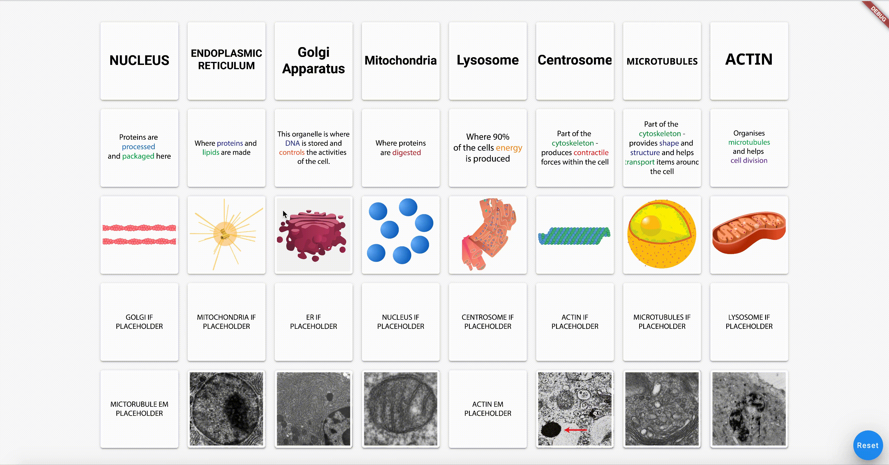

# Flutter matching game

This game was originally created for a scientific outreach event, where children had to try to identify cell organelles and match them correctly to their associated microscopy images.

## Specifying cards

Columns are defined by the cardtype map and rows are specified by the organelle map in [gameSettings.dart](lib/gameSettings.dart) respectively. The string value for each item is used to create the expected filename for the image for each card in the format "organelle + cardtype + .png" in the assets folder. For example, the expected filename of the image for title card of the nucleus would be nucleustitle.png.

## Celebratory gif

Upon completing the game players are shown a random celebratory gif which is specified in [gameSettings.dart](lib/gameSettings.dart).

## Card Image licences

The document [here](imagelicence.csv) contains all the information of the sources and licencing of the included images. 
